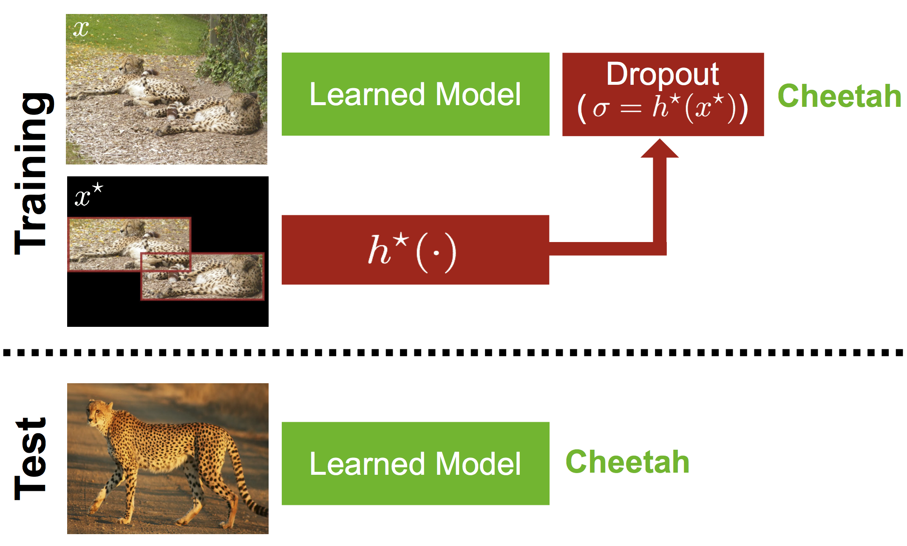
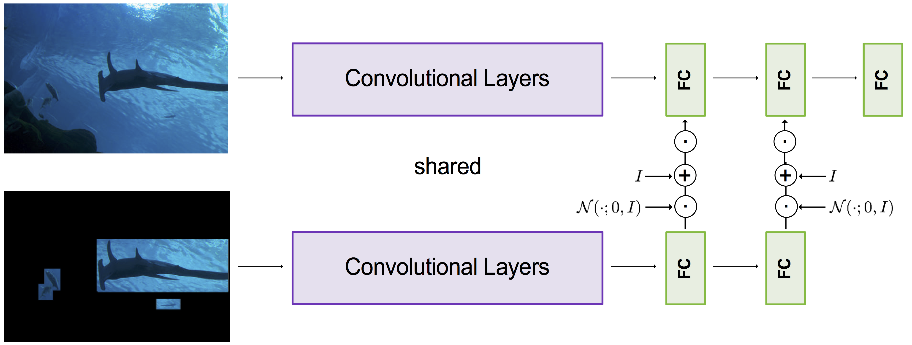
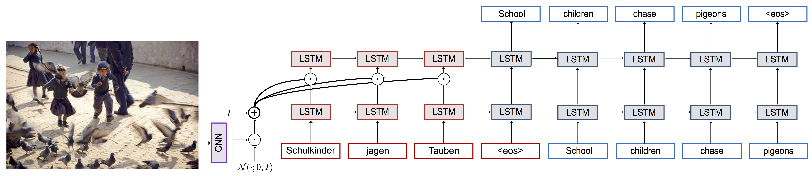

## News
- We express our thanks to Oxford and Imperial College London researchers, who showed how our PI-Dropout can be used for large gains over the state-of-the-art in reinforcement learning in their [recent paper](https://arxiv.org/abs/2005.09220) at the *Beyond tabula rasa in RL* workshop at ICLR 2020.

# dlupi-heteroscedastic-dropout
Deep Learning under Privileged Information Using Heteroscedastic Dropout (CVPR 2018, Official Repo)

This is the code for the paper:

**[Deep Learning Under Privileged Information Using Heteroscedastic Dropout](http://svl.stanford.edu/projects/heteroscedastic-dropout)**
<br>
[John Lambert*](https://github.com/johnwlambert),
[Ozan Sener*](http://ozansener.net/),
[Silvio Savarese](http://cvgl.stanford.edu/silvio/)
<br>
Presented at [CVPR 2018](http://cvpr2018.thecvf.com/)

The paper can be found on ArXiv [here](https://arxiv.org/abs/1805.11614).

This repository also includes an implementation for repeatable random data augmentation transformations, useful for transforming images and bounding boxes contained therein identically.

<div align='center'>
  
</div>


- The DLUPI models [used in the paper](#models-from-the-paper)
- Code for [training new feedforward CNN models](#running-on-new-images)
- Code for [training new feedforward RNN models](#running-on-new-images)

If you find this code useful for your research, please cite

```
@InProceedings{Lambert_2018_CVPR,
author = {Lambert, John and Sener, Ozan and Savarese, Silvio},
title = {Deep Learning Under Privileged Information Using Heteroscedastic Dropout},
booktitle = {The IEEE Conference on Computer Vision and Pattern Recognition (CVPR)},
month = {June},
year = {2018}
}
```

In this repository we provide:
- Top-k Multi-crop testing framework
- Top-k Single-crop testing framework
- Reproducible (repeatable) random image transformations
- Curriculum learning examples in PyTorch
- Base and derived class examples with virtual functions in Python

We also provide implementations of various baselines that use privileged information, including:


- J. Hoffman, S. Gupta, and T. Darrell. [Learning with Side Information through Modality Hallucination](https://people.eecs.berkeley.edu/~sgupta/pdfs/hoffman2016learning.pdf). In CVPR, 2016.
- Y. Chen, X. Jin, J. Feng, and S. Yan. [Training Group Orthogonal Neural Networks with Privileged Information](https://arxiv.org/abs/1701.06772). In IJCAI, 2017. Pages 1532-1538. https://doi.org/10.24963/ijcai.2017/212.
- H. Yang, J. Zhou, J. Cai, and Y.S. Ong. [MIML-FCN+: Multi-Instance Multi-Label Learning via Fully Convolutional Networks With Privileged Information](https://arxiv.org/abs/1702.08681). In CVPR, 2017.
- N. Srivastava, G. Hinton, A. Krizhevsky, I. Sutskever, and R. Salakhutdinov. [Dropout: A Simple Way to Prevent Neural Networks from Overfitting](https://www.cs.toronto.edu/~hinton/absps/JMLRdropout.pdf). In JMLR, 2014. Pages 1929−1958.
- A. Achille, S. Soatto. [Information Dropout: learning optimal representations through noisy computation](https://arxiv.org/abs/1611.01353). Transactions on Pattern Analysis and Machine Intelligence (PAMI), 2018.
- K. Simonyan, A. Zisserman. [Very Deep Convolutional Networks for Large-Scale Image Recognition](https://arxiv.org/abs/1409.1556). In ICLR, 2015.

## Setup
All code is implemented in [PyTorch](http://pytorch.org/).

First [install PyTorch, torchvision, and CUDA](http://pytorch.org/), then
update / install the following packages:

(with Conda and Python 2.7 on Linux the instructions [here](http://pytorch.org/) will look something like)
```bash
conda install pytorch torchvision -c pytorch
```

### (Optional) GPU Acceleration

If you have an NVIDIA GPU, you can accelerate all operations with CUDA.

First [install CUDA](https://developer.nvidia.com/cuda-downloads).

### (Optional) cuDNN

When using CUDA, you can use cuDNN to accelerate convolutions.

First [download cuDNN](https://developer.nvidia.com/cudnn) and copy the libraries to `/usr/local/cuda/lib64/`. 


### Pretrained CNN Models

<div align='center'>
  
</div>

Download all pretrained CNN models from Google Drive by running the script

```bash
bash models/download_CNN_models.sh
```

<!-- This will download ten model files (~200MB) to the folder `models/`.
 -->

## Download ImageNet CLS-LOC

<div align='center'>
  
</div>

First,[register and create an ImageNet account.](http://image-net.org/download-images)

Next, download the 1.28 Million images

Now, we need to download the XML bounding box annotations, either [via the link here](http://image-net.org/Annotation/Annotation.tar.gz) (42.8 MB in size).
or via command line
```bash
wget http://image-net.org/Annotation/Annotation.tar.gz
```
The XML annotations are stored in recursive tar.gz files. They can be recursively unzipped via tar, which will take around 10 minutes on a typical workstation:
```bash
mkdir bbox_annotation
tar -xvzf Annotation.tar.gz -C bbox_annotation
rm Annotation.tar.gz
cd bbox_annotation
for a in `ls -1 *.tar.gz`; do gzip -dc $a | tar xf -; done
rm *.tar.gz
```

Now, we have a directory called `bbox_annotation/Annotation` that contains .xml files with bounding box information for 3,627 classes ("synsets") of ImageNet. We will use only the 1000 classes featured in the ImageNet Large-Scale Visual Recognitiion Challenge (ILSVRC) task.

At this point, we'll arrange the image data into three folders: "train", "val", and "test".

6.3G `val.zip`
56G `train.zip`

On the ILSVRC 2016 page on the ImageNet website, find and download the file named
```bash
ILSVRC2016_CLS-LOC.tar.gz
```
This is the Classification-Localization dataset (155GB),unchanged since ILSVRC2012. There are a total of 1,281,167 images for training. The number of images for each synset (category) ranges from 732 to 1300. There are 50,000 validation images, with 50 images per synset. There are 100,000 test images. All images are in JPEG format.

It is arranged as follows: `{split}/{synset_name}/{file_name}.JPEG` 

For example, `ImageNet_2012/train/n02500267/02500267_2597.JPEG`

We will use the bounding box subset of the images from CLS-LOC (that have bounding box information). We'll then use subsets of the images with annotated bounding boxes to evaluate sample efficiency. Run:
```bash
mkdir ImageNetLocalization
python cnns/imagenet/create_bbox_dataset.py
python cnns/imagenet/create_imagenet_test_set.py
```


<!-- ## Models from the paper
The style transfer models we used in the paper will be located in the folder `models/cvpr18`.
Here are some example results where we use these models to stylize this
image of the Chicago skyline with at an image size of 512:
 -->
<!-- <div align='center'>
  
</div>


<br>


Here are some example outputs from these models, with an image size of 1024:

<div align='center'>
  
  
  
  
  <br>
  
  
  
  
  <br>
  
  
  
  
</div> -->


## Training CNN Models From Scratch

The script `train.py` lets you train a new CNN model from scratch.

```bash
python cnns/train/train.py
```

By default this script runs on GPU; to run on CPU, remove the .cuda() lines within the code.

<!-- The full set of options for this script is [described here](doc/flags.md#fast_neural_stylelua).
 -->

<!-- ## Webcam demo
You can use the script `webcam_demo.lua` to run one or more models in real-time
off a webcam stream. To run this demo you need to use `qlua` instead of `th`:

```bash
qlua webcam_demo.lua -models models/instance_norm/candy.t7 -gpu 0
```

You can run multiple models at the same time by passing a comma-separated list
to the `-models` flag:

```bash
qlua webcam_demo.lua \
  -models models/instance_norm/candy.t7,models/instance_norm/udnie.t7 \
  -gpu 0
```

With a Pascal Titan X you can easily run four models in realtime at 640x480:

<div align='center'>
  
</div>

The webcam demo depends on a few extra Lua packages:
- [clementfarabet/lua---camera](https://github.com/clementfarabet/lua---camera)
- [torch/qtlua](https://github.com/torch/qtlua)

You can install / update these packages by running:

```bash
luarocks install camera
luarocks install qtlua
```

The full set of options for this script is [described here](doc/flags.md#webcam_demolua).


## Training new models

You can [find instructions for training new models here](doc/training.md).

## Optimization-based Style Transfer

The script `slow_neural_style.lua` is similar to the
[original neural-style](https://github.com/jcjohnson/neural-style), and uses
the optimization-based style-transfer method described by Gatys et al.

This script uses the same code for computing losses as the feedforward training
script, allowing for fair comparisons between feedforward style transfer networks
and optimization-based style transfer.

Compared to the original [neural-style](https://github.com/jcjohnson/neural-style),
this script has the following improvements:

- Remove dependency on protobuf and [loadcaffe](https://github.com/szagoruyko/loadcaffe)
- Support for many more CNN architectures, including ResNets

The full set of options for this script is [described here](doc/flags.md#slow_neural_stylelua).
 -->
## License

Free for personal or research use; for commercial use please contact me.


## Pretrained RNN Models

<div align='center'>
  
</div>

File explaining some of the model names: https://docs.google.com/document/d/1KBjYK52Jvcd8cYpIZPPRUrXGSu6jFsBL5O3FwvtBr_Q/edit?usp=sharing

- X* 75K, ADAPTIVE DECAY, [Model link](https://drive.google.com/drive/folders/1kRZbtWDk3a9hkoriqVuuA_tU5TsIFNPP?usp=sharing)
```
 { 'model_type' : ModelType.DROPOUT_FN_OF_XSTAR,
   'model_fpath': '/vision/group/ImageNetLocalization/saved_imagenet_models/ImageNet_Localization_1000_Class_75perclass_identity_ATtest_lambda100_BS64'
 },
```

- Modal. Hallucination shared params RGB MASK, [Model link](https://drive.google.com/drive/folders/1p6BXke0a4R0Qh7U_965hIOOPvu2nfCtC?usp=sharing)
```
 { 'model_type' : ModelType.MODALITY_HALLUC_SHARED_PARAMS,
   'model_fpath': '/vision/group/ImageNetLocalization/saved_SGDM_imagenet_models/2018_03_25_05_46_34_num_ex_per_cls_75_bs_128_optimizer_type_sgd_model_type_ModelType.MODALITY_HALLUC_SHARED_PARAMS_lr_0.01_fixlrsched_False'},
```

- MIML-FCN/VGG RGB MASK [Model link](https://drive.google.com/drive/folders/1FjQ_d0LnFnHZf0tEhiqS7_z9_WO-MM1k?usp=sharing)
```
 { 'model_type' : ModelType.MIML_FCN_VGG,
   'model_fpath': '/vision/group/ImageNetLocalization/saved_SGDM_imagenet_models/2018_03_25_05_31_49_num_ex_per_cls_75_bs_128_optimizer_type_sgd_model_type_ModelType.MIML_FCN_VGG_lr_0.01_fixlrsched_False'},
```

- MIML-FCN [40]/ResNet RGB MASK [Model link](https://drive.google.com/drive/folders/1DySZFsGbqZnJZQw8J9nROEFHlIWanlL5?usp=sharing)
```
 { 'model_type' : ModelType.MIML_FCN_RESNET,
   'model_fpath': '/vision/group/ImageNetLocalization/saved_SGDM_imagenet_models/2018_03_25_02_59_54_num_ex_per_cls_75_bs_256_optimizer_type_sgd_model_type_ModelType.MIML_FCN_RESNET_lr_0.1_fixlrsched_False'},
```

- GoCNN, VGG, scale coeff down by 320 [Model link](https://drive.google.com/drive/folders/1CrtJxZDCeq_4QXaKpYz9l3kdC3FW2JE8?usp=sharing)
```
 { 'model_type' : ModelType.GO_CNN_VGG,
   'model_fpath': '/vision/group/ImageNetLocalization/saved_SGDM_imagenet_models/2018_03_24_04_20_02_num_ex_per_cls_75_bs_256_optimizer_type_adam_model_type_ModelType.GO_CNN_VGG_lr_0.001_fixlrsched_False'},
```

- Random Gaussian Dropout [Model link](https://drive.google.com/drive/folders/1-lzF9IR_lDRPhMxGsaSaP2VsLaWCzuWS?usp=sharing)
```
 { 'model_type' : ModelType.DROPOUT_RANDOM_GAUSSIAN_NOISE,
   'model_fpath': '/vision/group/ImageNetLocalization/saved_SGDM_imagenet_models/2018_03_22_07_28_56_num_ex_per_cls_75_bs_256_optimizer_type_sgd_model_type_ModelType.DROPOUT_RANDOM_GAUSSIAN_NOISE_lr_0.01_fixlrsched_False'},
```

- NO X*	75k	adaptive decay, bs = 256	, [Model link](https://drive.google.com/drive/folders/1GLopFs-smoZe8zpHQR27W2bQb35c14CD?usp=sharing)
```
 { 'model_type' : ModelType.DROPOUT_BERNOULLI,
   'model_fpath': '/vision/group/ImageNetLocalization/saved_SGDM_imagenet_models/2018_03_07_13_20_12_num_ex_per_cls_75_bs_256_optimizer_type_sgd_dropout_type_bernoulli_lr_0.01_fixlrsched_False'},
```

